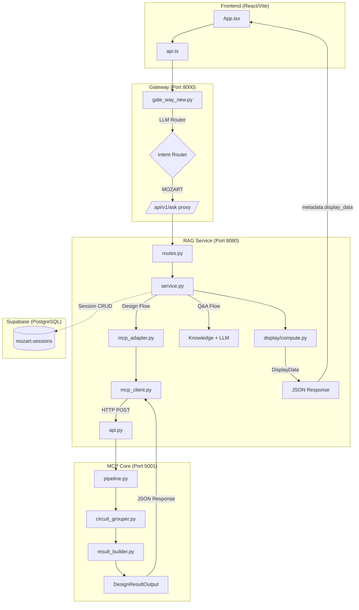

# 🏛️ Mozart Architecture: Full System Data Flow

> **เอกสารนี้สำหรับ:** Debug ปัญหา "กล่องว่าง" (Null/Empty Data) และ E2E Flow Reference
> **อัพเดท:** 2026-01-01 (Added Gateway, Supabase, Computed Data Layer)

---

## 📊 System Overview Diagram (Updated 2026-01)




---

## 🔄 Data Flow: Class by Class

### Stage 1: RAG → MCP Core (Request)

```
┌─────────────────────────────────────────────────────────────────────────┐
│ RAG SERVICE                                                              │
├─────────────────────────────────────────────────────────────────────────┤
│                                                                          │
│  ┌──────────────────┐     ┌───────────────────┐     ┌────────────────┐  │
│  │   service.py     │────▶│  mcp_adapter.py   │────▶│  mcp_client.py │  │
│  │                  │     │                   │     │                │  │
│  │  User Input      │     │  McpElectricalLoad│     │  HTTP POST     │  │
│  │  (text/JSON)     │     │  McpDesignRequest │     │  to MCP Core   │  │
│  └──────────────────┘     └───────────────────┘     └────────────────┘  │
│                                   │                         │            │
│                                   │ to_dict()               │            │
│                                   ▼                         │            │
│                           ┌───────────────┐                 │            │
│                           │ {             │                 │            │
│                           │  "loads": [], │─────────────────┘            │
│                           │  "panels": [] │                              │
│                           │ }             │                              │
│                           └───────────────┘                              │
└─────────────────────────────────────────────────────────────────────────┘
                                    │
                                    │ HTTP POST /api/v1/design
                                    ▼
┌─────────────────────────────────────────────────────────────────────────┐
│ MCP CORE                                                                 │
├─────────────────────────────────────────────────────────────────────────┤
│                                                                          │
│  ┌──────────────────┐     ┌───────────────────┐     ┌────────────────┐  │
│  │     api.py       │────▶│   pipeline.py     │────▶│result_builder  │  │
│  │                  │     │                   │     │                │  │
│  │  LoadInput       │     │  ElectricalLoad   │     │  DesignResult  │  │
│  │  (Pydantic)      │     │  (Contract Model) │     │  (Contract)    │  │
│  └──────────────────┘     └───────────────────┘     └────────────────┘  │
│         │                         │                         │            │
│         │ _convert_to_internal()  │ group_loads()           │            │
│         ▼                         ▼                         │            │
│  ┌──────────────────┐     ┌───────────────────┐             │            │
│  │ ElectricalLoad   │     │  GroupedCircuit   │─────────────┘            │
│  │ (Contract Model) │     │  (Dataclass)      │                          │
│  └──────────────────┘     └───────────────────┘                          │
│                                   │                                      │
│                                   │ ❌ PROBLEM POINT!                    │
│                                   │ (ต้องมี to_dict() !!!)                │
│                                   ▼                                      │
└─────────────────────────────────────────────────────────────────────────┘
```

---

## 📦 Class Definitions & Contracts

### RAG Side Classes

| File | Class | Purpose | Output Type |
|------|-------|---------|-------------|
| `mcp_adapter.py` | `McpElectricalLoad` | Convert user input to MCP format | `@dataclass` → `to_dict()` |
| `mcp_adapter.py` | `McpDesignRequest` | Wrap loads + panels for API call | `@dataclass` → `to_dict()` |
| `mcp_client.py` | `McpDesignResponse` | Parse MCP Core response | `@dataclass` → `to_dict()` |
| `merge_engine.py` | `merge_design_changes` | Logic for merging user edits | `Dict` (Merged Session) |
| `session_injector.py` | `SessionData` | Database Schema Mirror | `@dataclass` → `to_dict()` |
| `llm_parser.py` | `EditCommand` | User intent representation | `@dataclass` → `to_dict()` |

### MCP Core Classes

| File | Class | Purpose | Serialize Method |
|------|-------|---------|------------------|
| `api.py` | `LoadInput` | Pydantic model for API input | Auto (BaseModel) |
| `api.py` | `DesignResultOutput` | Pydantic model for API output | Auto (BaseModel) |
| `models/contracts.py` | `ElectricalLoad` | Internal load representation | `model_dump()` |
| `models/contracts.py` | `DesignResult` | Full calculation result | `model_dump()` |
| `circuit_grouper.py` | `GroupedCircuit` | **❌ WAS MISSING `to_dict()`** | `to_dict()` 🆕 |

---

## 🔴 Common Failure Points (กล่องว่าง/Null Problems)

### Failure Point 1: Dataclass → JSON (THE ROOT CAUSE)

```python
# ❌ WRONG (Pydantic cannot serialize Python objects)
class GroupedCircuit:  # @dataclass
    circuit_id: str
    loads: List[ElectricalLoad]  # Python objects!

def group_loads(...) -> Dict[str, GroupedCircuit]:
    return self.circuits  # Returns Python objects, NOT JSON!

# ✅ CORRECT
class GroupedCircuit:
    def to_dict(self) -> Dict[str, Any]:
        return {'circuit_id': self.circuit_id, ...}

def group_loads(...) -> List[Dict[str, Any]]:
    return [c.to_dict() for c in self.circuits.values()]
```

**Symptom:** API returns `grouped_circuits: []` or `null`
**Debug:** Check if the class has `to_dict()` method

---

### Failure Point 2: Field Name Mismatch

```python
# RAG expects:
response.get("grouped_circuits")  # lowercase, underscore

# MCP might send:
{"groupedCircuits": [...]}  # camelCase → MISMATCH!
```

**Symptom:** Field exists in one side but `None` in other
**Debug:** Log both sides and compare key names

---

### Failure Point 3: Type Mismatch (Pydantic Silent Drop)

```python
# API Model expects:
grouped_circuits: Optional[List[Dict[str, Any]]] = None

# Pipeline returns:
Dict[str, GroupedCircuit]  # Object, not List!

# Pydantic Behavior:
# → Silent fail → returns None or []
```

**Symptom:** No error, but field is empty
**Debug:** Compare return type vs Pydantic model type

---

### Failure Point 4: Missing Field in Response Parsing

```python
# McpDesignResponse (RAG side)
@dataclass
class McpDesignResponse:
    success: bool
    calculations: Dict
    # ❌ MISSING: grouped_circuits was not declared!

# Fix: Add the field
    grouped_circuits: Optional[list] = None  # 🆕
```

**Symptom:** MCP Core sends data, but RAG doesn't receive
**Debug:** Check both Pydantic models match

---

## 🛠️ Debug Checklist (When Data is Missing)

```
1. RAG SIDE
   □ McpElectricalLoad.to_dict() - มี method นี้ไหม?
   □ McpDesignRequest.to_dict() - ส่ง field ครบไหม?
   □ McpDesignResponse - มี field ที่ต้องการไหม?

2. MCP CORE SIDE
   □ LoadInput (api.py) - มี field ที่ RAG ส่งมาไหม?
   □ _convert_to_internal() - แปลงค่าถูกไหม?
   □ GroupedCircuit.to_dict() - 🆕 ต้องมี!
   □ DesignResult (contracts.py) - มี field ไหม?
   □ _convert_to_output() - map field ครบไหม?
   □ DesignResultOutput (api.py) - ประกาศ field ไหม?

3. PYDANTIC RULES
   □ Return type ตรงกับ Model Type ไหม?
   □ Field names ตรงกันทั้งสองฝั่งไหม? (case-sensitive!)
   □ Nested objects มี serialize method ไหม?
```

---

## 📊 Complete Data Flow Table

| Step | Source | Destination | Class | Method | Output |
|:----:|--------|-------------|-------|--------|--------|
| 1 | User | service.py | - | process_design() | Dict |
| 2 | service.py | mcp_adapter.py | McpElectricalLoad | to_dict() | Dict |
| 3 | mcp_adapter.py | mcp_client.py | McpDesignRequest | to_dict() | JSON |
| 4 | mcp_client.py | api.py | LoadInput | Pydantic auto | Model |
| 5 | api.py | pipeline.py | ElectricalLoad | _convert_to_internal() | Model |
| 6 | pipeline.py | circuit_grouper.py | GroupedCircuit | to_dict() 🆕 | List[Dict] |
| 7 | circuit_grouper.py | result_builder.py | DesignResult | - | Model |
| 8 | result_builder.py | api.py | DesignResultOutput | _convert_to_output() | Pydantic |
| 9 | api.py | mcp_client.py | McpDesignResponse | data.get() | Dict |
| 10 | mcp_client.py | markdown_formatter.py | - | format() | Markdown |

---

## 🚨 Golden Rules (ป้องกันปัญหา)

1. **ทุก `@dataclass` ที่ส่งผ่าน API ต้องมี `to_dict()`**
2. **ทุก Field ที่ต้องการ ต้องประกาศใน Pydantic Model ทั้งสองฝั่ง**
3. **Return Type ต้องตรงกับ Model Type (ไม่ใช่ Object)**
4. **Log ก่อนส่ง, Log หลังรับ เพื่อเปรียบเทียบ**

---

## 🆕 Computed Data Layer (2025-12-30)

### Data Flow:
```
mcp_result (from to_dict())
       │
       └──→ compute.py ──→ DisplayData (JSON dict)
                          ↓
             ┌────────────┼────────────┐
             │            │            │
             ↓            ↓            ↓
         markdown_    audit_      pdf_
         renderer     document    formatter
             │            │            │
             ↓            ↓            ↓
         Markdown    Audit MD      BOQ
```

### New Files:
| File | Purpose |
|------|---------|
| `app/display/__init__.py` | Package exports |
| `app/display/compute.py` | **Source of Truth** - compute once |
| `app/display/markdown_renderer.py` | Render Markdown (no calc) |

### Modified Files:
| File | Change |
|------|--------|
| `app/models.py` | Added: `display_data`, `audit_results`, `pdf_data`, `sld_data` |
| `app/service.py` | Import compute_display_data + send in metadata |
| `frontend/src/App.tsx` | Use display_data from API |
| `frontend/src/types/index.ts` | Added DisplayData, CircuitData, PDFData |
| `frontend/src/lib/api.ts` | Added types in AskResponse |

---

*สร้างโดย: Mozart Architecture Team | 2025-12-24*
*อัปเดต: Fixia | 2025-12-30 (Computed Data Layer)*
