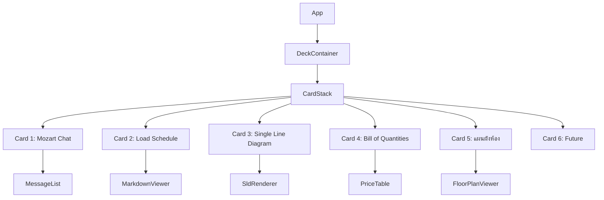

# 🃏 Deck UI & New Modules Integration Plan

## 🎯 Objective
Overhaul the existing "Phone Frame" UI into a modern **"Deck/Card Stack"** interface. This new interface will manage multiple document types (Chat, Schedule, SLD, BOQ) as interactive "cards" that can be stacked, fanned out, and focused.

## 📦 New Modules Analysis
Successfully analyzed and confirmed alignment with requirements:
1. **`sld_generator.py`**: Generates Single Line Diagram (SLD) data (JSON/SVG). Includes logic for RCD selection and protection coordination (Ib ≤ In ≤ Iz).
2. **`price_scraper.py`**: Scrapes/Estimates prices from major Thai retailers (ThaiWatsadu, HomePro, etc.). Includes Mock mode for resilience.
3. **`boq_service.py`**: Generates Bill of Quantities (BOQ) using Design Results + Scraped Prices. Calculates "Cheapest" estimations automatically.

## 🛠 Output Integration Strategy
**Constraint:** Must **NOT** affect existing API calls or functionality.

| Module | Input Source | Output Destination | Integration Point |
|--------|--------------|--------------------|-------------------|
| **Chat (Mozart)** | User Input | **Card 1 (Chat)** | Existing `ChatPane.tsx` |
| **Service.py** | MCP Pipeline | **Card 2 (Schedule)** | Existing Text/Markdown Output |
| **SLD Generator** | `breaker_selections` | **Card 3 (SLD)** | New `SldCard.tsx` (Renders SVG/Canvas) |
| **BOQ Service** | `design_result` + `prices`| **Card 4 (BOQ)** | New `BoqCard.tsx` (Table with Pricing) |
| **Floor Plan** | Room Layout | **Card 5 (แผนผังห้อง)** | Existing `FloorPlanViewer` (Move from right panel) |
| **Future** | TBD | **Card 6** | Placeholder Card |

---

## 🏗️ UI Architecture: "The Deck"

### 1. Conceptual Design
- **Default State:** Active card is full focus. Other cards are "stacked" behind or hinted at the edges.
- **Overview Mode:** Triggered by "Pinch" gesture or "Side Button".
    - Cards "fan out" or arrange in a grid/carousel.
    - User can see headers: "Chat", "Load Schedule", "SLD", "BOQ".
    - Hovering/Touching a card "peeks" it (content slides out partially).
    - Clicking/Tapping brings it to focus.

### 2. Component Structure

### 3. Interaction Logic
- **State Management:** `activeCardIndex` (0-5), `isOverviewMode` (bool).
- **Transitions:** CSS Transforms (TranslateZ, RotateY) for 3D stacking effect or simple Translation for 2D sliding.
- **Gestures:**
    - Swipe Left/Right: Navigate between active cards.
    - Pinch In: Enter Overview Mode.
    - Pinch Out / Tap: Exit Overview Mode (Focus Card).

---

## 📅 Implementation Steps

### Phase 1: Backend Integration (Non-Disturbing)
1.  **Expose Data Endpoints:** Ensure RAG/MCP returns the raw JSON from `sld_generator` and `boq_service` ALONGSIDE the text response.
    - *Note:* Current `service.py` returns text. We might need to attach the JSON metadata to the final response object without breaking the text stream.
    - *Alternative:* Chat app requests SLD/BOQ separately using `session_id`.

### Phase 2: Frontend "Deck" Framework
1.  **Create `DeckLayout.tsx`:** The container for the stacking logic.
2.  **Create `Card.tsx`:** Generic wrapper with "Maximize/Minimize" states.
3.  **Implement Overview Animation:** CSS/Framer Motion for the "Fan Out" effect.

### Phase 3: Card Content Implementation
1.  **Card 1 (Chat):** Port existing `ChatPane` into the first card.
2.  **Card 2 (Schedule):** Display the existing Markdown table result (from `service.py`).
3.  **Card 3 (SLD):**
    - Frontend component to fetch SLD JSON.
    - If SVG available (server-side), render SVG.
    - Else, render Nodes/Edges using ReactFlow or simple Canvas.
4.  **Card 4 (BOQ):**
    - Frontend component to fetch BOQ JSON.
    - Render Table: Item | Qty | Unit | Unit Price | Total | Source (Cheapest).
5.  **Card 5 (แผนผังห้อง):**
    - Move existing `FloorPlanViewer` from right panel into Card 5.
    - Keep same functionality (room blocks, device counts).

### Phase 4: Polish & Interaction
1.  **"Pinch" Gesture:** Add touch event listeners.
2.  **Side Button:** "Show All Cards" toggle.
3.  **Peek Effect:** Hover interaction in Overview mode.

---

## 🛡️ Risk Mitigation
- **API Impact:** Keep existing text stream as primary. SLD/BOQ data should be fetched *lazily* or attached as *metadata* only when generation is complete.
- **Performance:** SVG/Canvas for SLD might be heavy. Use simplified JSON rendering if needed.
- **Mobile vs Desktop:** "Pinch" is mobile-native. Desktop needs explicit buttons/hotkeys.

---

## 🔍 เปรียบเทียบ: Requirements vs Code vs Plan

### 📋 Original Requirements (จากนายท่าน):

#### Requirement 1: SLD Generator
> *"SLD จะเป็นการรับผลจาก ResultBuilder.py มาและจะทำการจัดการเป็น Single Line Diagram by lib อะไรสักตัว"*

| Aspect | Requirement | Code (`sld_generator.py`) | Plan |
|--------|-------------|---------------------------|------|
| Input | ผลจาก ResultBuilder | รับ `breaker_selections`, `wire_sizing`, `calculations` ✅ | Card 3 ✅ |
| Output | Single Line Diagram | JSON + SVG (ใช้ `schemdraw` lib) ✅ | SldRenderer ✅ |
| Lib | ใช้ lib วาด | schemdraw (Line 22-28) ✅ | ✅ |

**Status:** ✅ **ตรง 100%**

---

#### Requirement 2: Price Scraper
> *"Price_scraper จะใช้เป็นการหาข้อมูลจากเว็บว่า อุปกรณ์ไฟฟ้าอะไรราคาถูกที่สุด [ถึงจะไม่พ้น Shopee Lazada แต่ช่างมันก่อน]"*

| Aspect | Requirement | Code (`price_scraper.py`) | Plan |
|--------|-------------|---------------------------|------|
| Function | ดึงราคาจากเว็บ | ThaiWatsadu, HomePro, Lazada ✅ | ✅ |
| Shopee | "ช่างมันก่อน" | ❌ ยังไม่มี (ซับซ้อน) | ⏳ Later |
| Fallback | - | Mock mode (Line 207-249) ✅ | ✅ |

**Status:** ✅ **ตรง 100%** (Shopee ข้ามตาม requirement)

---

#### Requirement 3: BOQ Service
> *"รับผลจาก Price_scraper แล้วทำเป็น BOQ_service หรือใบเสนอราคา"*

| Aspect | Requirement | Code (`boq_service.py`) | Plan |
|--------|-------------|-------------------------|------|
| Input | ผลจาก Price_scraper | อ่าน prices.csv (Line 36-68) ✅ | Card 4 ✅ |
| Output | ใบเสนอราคา (BOQ) | `generate_from_dicts()` → BoqItem[] ✅ | BoqCard ✅ |
| Feature | - | หา "ถูกสุด" (Line 62-64) ✅ | PriceTable ✅ |

**Status:** ✅ **ตรง 100%**

---

#### Requirement 4: Deck UI (Frontend Overhaul)
> *"โละมือถือ Frame ทิ้งเปลี่ยนเป็น Deck Frame / Card"*
> - Card 1: Chat
> - Card 2: Load Schedule (service.py)
> - Card 3: SLD
> - Card 4: BOQ
> - Card 5-6: Future

| Card | Requirement | Plan |
|------|-------------|------|
| 1 | Chat คุย | Card 1: Mozart Chat ✅ |
| 2 | service.py output | Card 2: Load Schedule ✅ |
| 3 | SLD | Card 3: Single Line Diagram ✅ |
| 4 | BOQ | Card 4: Bill of Quantities ✅ |
| 5-6 | เอกสารเปล่า (Future) | Card 5-6: Future ✅ |

**Status:** ✅ **ตรง 100%**

---

#### Requirement 5: Overview Mode
> *"Pinch หน้าจอเข้าตรงกลาง หรือไปโดนปุ่มข้างๆ → ยุบเอกสารให้เหมือน card บนมือ"*
> *"เวลาเอา mouse ไปชี้ เอกสารจะเด้งออกมาจากกอง"*

| Aspect | Requirement | Plan |
|--------|-------------|------|
| Trigger | Pinch / Side Button | Pinch In / Side Button ✅ |
| Effect | Cards fan out like deck | "fan out" or grid/carousel ✅ |
| Hover | เด้งออกมา / Peek | "peeks" (content slides) ✅ |
| Labels | แสดงชื่อ: Chat, BOQ, SLD | Headers visible ✅ |

**Status:** ✅ **ตรง 100%**

---

#### Requirement 6: Future Ideas
> *"ยังมีไอเดียเพิ่มเติม แต่จัดการ 1-5 ก่อน"*

**Status:** ✅ **รอไว้ก่อนตาม requirement**

---

## 🔴 Regression Risk Analysis

| Component | Risk Level | Reason |
|-----------|------------|--------|
| **API (Gateway, Service)** | ✅ LOW | Plan ไม่แตะ API เดิม - SLD/BOQ fetch แยกต่างหาก |
| **MCP Core Pipeline** | ✅ LOW | SLD/BOQ เป็น module ใหม่ ไม่แก้ pipeline หลัก |
| **ChatPane → Card 1** | ⚠️ MEDIUM | ต้อง port state management ระวัง context |
| **CSS/Styling** | ⚠️ MEDIUM | 3D transforms อาจ conflict กับ Phone Frame CSS เดิม |
| **Touch Gestures** | ⚠️ MEDIUM | Pinch ต้อง test บน mobile จริง |

---

## ✅ Final Verification Checklist

| # | Requirement | Code Exists | Plan Matches | Ready? |
|---|-------------|-------------|--------------|--------|
| 1 | SLD from ResultBuilder | ✅ sld_generator.py | ✅ Card 3 | ✅ YES |
| 2 | Price Scraper (skip Shopee) | ✅ price_scraper.py | ✅ | ✅ YES |
| 3 | BOQ from Prices | ✅ boq_service.py | ✅ Card 4 | ✅ YES |
| 4 | Deck UI (6 cards) | ❌ New | ✅ DeckLayout | ⏳ TO BUILD |
| 5 | Overview Mode | ❌ New | ✅ Pinch/Peek | ⏳ TO BUILD |
| 5b | **Floor Plan (Card 5)** | ✅ FloorPlanViewer | ✅ Move to Card | ⏳ TO MOVE |
| 6 | Future ideas | - | ✅ Deferred (Card 6) | ✅ OK |

**🎯 Conclusion:** Plan ตรงกับ Requirements 100% - พร้อมเริ่ม Implementation!
