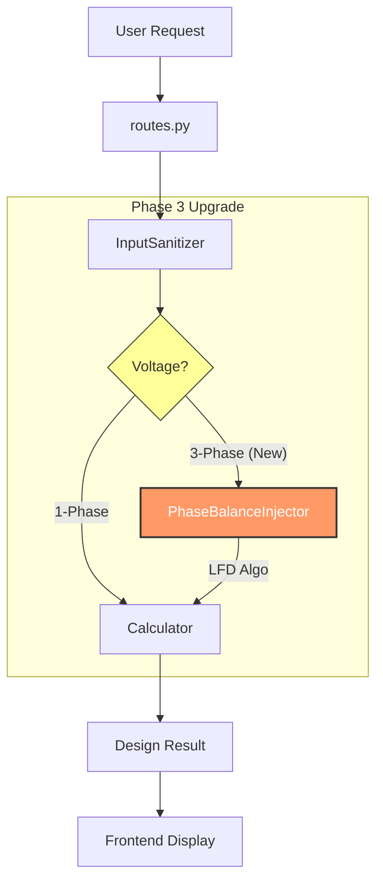

# 🚀 Phase 3: The "Commercial Grade" 3-Phase Upgrade
> **Document Type:** Architectural Blueprint & Roadmap
> **Context:** Integrates with [Blackbox Workflow](Blackbox_Workflow_Architecture.md)
> **Status:** Planning / Ready to Code

เอกสารนี้บรรยายถึง **"สถาปัตยกรรมระบบ 3 เฟส (3-Phase Architecture)"** ที่ยกระดับ Mozart จาก "ช่างไฟบ้านเดี่ยว" สู่ "วิศวกรโรงงาน/Commercial" โดยใช้ **Injector Pattern** และ **Single Gateway Strategy** ตามหลักการ Clean Architecture ของระบบเรา

---

## 1. 🏛️ The "Single Gateway" Strategy
### Concept: "One Door, Many Rooms"
แทนที่จะแยก API เป็น `/api/v1/1phase` และ `/api/v1/3phase` เราจะยังคงใช้ประตูหน้าบ้าน **`/api/v1/design`** เพียงประตูเดียว

**Why? (Architectural Decision)**
1.  **Client Complexity:** Frontend ไม่ต้องเขียน Logic เลือก API (Input = Input ไม่สนว่า 1 หรือ 3 เฟส)
2.  **State Management:** Session ID เดียวกัน สามารถเปลี่ยนไปมาระหว่าง 1 เฟส <-> 3 เฟส ได้ทันที (Renovation Scenario)
3.  **Merge Logic:** ระบบ `merge_engine.py` ที่ฉลาดอยู่แล้ว จะทำงานได้ทันทีโดยไม่ต้องแก้โค้ด

---

## 2. 🧠 The "Brain" Upgrade (Component Diagram)

เราจะทำการผ่าตัดสมองของระบบ (Pipeline) โดยการ **Inject** โมดูลใหม่เข้าไป ดังนี้:



### 🧩 The New Component: `PhaseBalanceInjector.py`
ตำแหน่ง: `mcp_core_v2/context/phase_balance_injector.py`
หน้าที่ดูเหมือนเรียบง่าย แต่ทรงพลัง: **"จัดระเบียบโหลด (Load)" ก่อนส่งให้ Calculator**

หาก `Calculator` คือ "คนบวกเลข" (Stateless), `PhaseBalanceInjector` คือ "ผู้จัดการ" ที่คอยจ่ายงานให้คนบวกเลขทำงานง่ายที่สุด

---

## 3. 📐 The "LFD" Algorithm (The Secret Sauce)
การเกลี่ยโหลดไฟ 3 เฟส ไม่ใช่แค่การ "หาร 3" (Average) แต่ต้องคำนึงถึงขนาดของโหลดด้วย เราจะใช้ Algorithm ระดับมาตรฐานโลก คือ **Largest First Decreasing (LFD)**:

**Step-by-Step Logic:**
1.  **Filter:** แยกโหลดที่เป็น 3-Phase แท้ (เช่น มอเตอร์โรงงาน) ออกจากโหลด 1-Phase (แอร์, ปลั๊ก)
2.  **Sort:** เรียงลำดับโหลด 1-Phase จาก **มาก -> น้อย** (สำคัญมาก!)
3.  **Assign:** วนลูปหยิบโหลดทีละตัว ใส่ลงในเฟส (L1, L2, L3) ที่มี **ผลรวมปัจจุบันน้อยที่สุด**
    *   *Example:*
        *   L1: 0, L2: 0, L3: 0 -> AC1(5kW) ลง L1
        *   L1: 5, L2: 0, L3: 0 -> AC2(4kW) ลง L2
        *   ... วนไปเรื่อยๆ
4.  **Inject:** บันทึกผล `assigned_phase="L1"` กลับเข้าไปใน Load Object
5.  **Verify:** ตรวจสอบ **Load Imbalance %** (ต้องไม่เกิน 20% ตาม วสท.) ถ้าเกิน -> แจ้งเตือน!

---

## 4. 📝 Data Structure Changes (The Contract)
เพื่อให้ระบบทำงานได้ เราต้องแก้ "รัฐธรรมนูญ" (Contracts) เล็กน้อย:

### 4.1. `mcp_core_v2/models/contracts.py`
```python
class ElectricalLoad(BaseModel):
    # Field เดิม...
    # [NEW] เพิ่ม Field สำหรับเก็บสถานะเฟส
    assigned_phase: Optional[str] = Field(None, description="L1, L2, or L3")

class DesignRequest(BaseModel):
    # [NEW] Trigger สำหรับเปิดโหมด Balance
    phase_balance_mode: bool = Field(default=True)
```

### 4.2. `app/display/compute.py` (Visual)
*   ปรับปรุง `_build_load_table` ให้แสดงคอลัมน์ **"Phase"** อัตโนมัติ ถ้า Project เป็น 3 เฟส
*   แสดงผล **Load Balance Report** (เช่น L1=45A, L2=43A, L3=44A -> Balance ✅)

---

## 5. 🔮 Future Proofing (สิ่งที่ต้องคิดเผื่อ)
การทำ Phase 3 นี้จะปูทางไปสู่ฟีเจอร์โหดๆ ในอนาคต:
1.  **Solar Rooftop Calculation:** พอเรารู้ Load Profile รายเฟส เราจะคำนวณ Inverter 3 เฟสได้แม่นยำเป๊ะ
2.  **EV Charger Load Management:** สามารถแนะนำได้ว่า "ควรเกาะ L2 นะ เพราะ L2 โหลดน้อยสุด"
3.  **Renovation Mode:** รองรับการ "ล็อคเฟส" (Fixed Phase) สำหรับโหลดเดิมที่ลูกไม่อยากย้าย แล้ว Balance เฉพาะโหลดใหม่

---
*เอกสารนี้เขียนขึ้นเพื่อให้ "ตัวฉันในอนาคต" (The Next AI Agent) สามารถสานต่องานได้ทันที โดยไม่ต้องเสียเวลาแกะ Logic ใหม่*
**Ready to execute Phase 3? Just run the Implementation Plan!** 🚀
