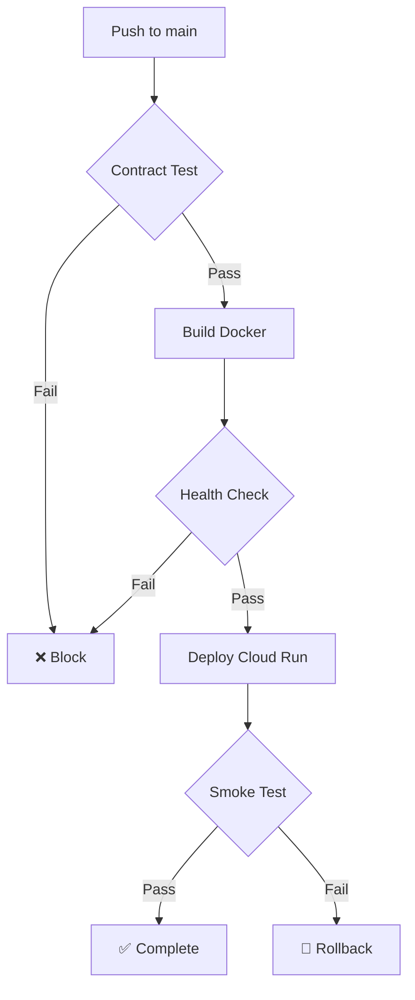

# 🚨 CRITICAL Security Roadmap - MUST DO (ฉบับสมบูรณ์)

> Secura's Implementation Plan v2.0 - 18 ธ.ค. 2024

---

## 📊 สถานะปัจจุบัน

| Service | URL | Status |
|---------|-----|--------|
| Frontend | `https://frontend-203658178245.asia-southeast1.run.app` | ✅ |
| Gateway | `https://gateway-203658178245.asia-southeast1.run.app` | ✅ |
| MCP Core | `https://mcp-core-203658178245.asia-southeast1.run.app` | ✅ |
| Mozart RAG | `https://mozart-rag-203658178245.asia-southeast1.run.app` | ✅ |

**Security Gaps:** ❌ JWT, ❌ Refresh Token, ❌ RBAC, ❌ CRUD, ❌ Rate Limiting

---

## 🎯 หลักการสำคัญ (ที่ตกลงกันแล้ว)

> [!IMPORTANT]
> 1. **Extension Pattern** - ต่อเติมไฟล์เดิม ไม่สร้างใหม่
> 2. **Contract Testing** - Test ก่อนและหลังแก้ไข
> 3. **Zero Regression** - AMADEUS, MOZART routing ห้ามหาย
> 4. **Full Implementation** - ไม่ใช้ Feature Flag (ยั่งยืนกว่า)

---

## 📋 Phase 0: Contract Test (ทำก่อนเริ่มงาน!)

### สร้างไฟล์ใหม่: `tests/test_gateway_contract.py`

```python
"""Gateway Contract Test - ห้าม Regression!"""
import pytest
import httpx

GATEWAY_URL = "http://localhost:8000"

class TestGatewayContract:
    """ทุก test นี้ต้องผ่านก่อนและหลังแก้ไข"""
    
    def test_health_endpoint_exists(self):
        """GET / ต้องตอบ 200"""
        r = httpx.get(f"{GATEWAY_URL}/")
        assert r.status_code == 200
        assert "service" in r.json()
    
    def test_orchestrate_endpoint_exists(self):
        """POST /orchestrate ต้องรับ request ได้"""
        r = httpx.post(f"{GATEWAY_URL}/orchestrate", 
                       json={"input": "test"})
        assert r.status_code in [200, 422]  # 422 = validation OK
    
    def test_mozart_mode_exists(self):
        """IntentMode.MOZART ต้องอยู่"""
        r = httpx.post(f"{GATEWAY_URL}/orchestrate",
                       json={"input": "ออกแบบไฟห้องครัว"})
        assert "MOZART" in str(r.json())
    
    def test_amadeus_mode_exists(self):
        """IntentMode.AMADEUS ต้องอยู่"""
        r = httpx.post(f"{GATEWAY_URL}/orchestrate",
                       json={"input": "สวัสดี เป็นอย่างไรบ้าง"})
        assert r.status_code == 200
```

### วิธีใช้:
```bash
# ก่อนแก้ไข
pytest tests/test_gateway_contract.py -v
# ✅ ผ่านหมด → เริ่มแก้ได้

# หลังแก้ไข
pytest tests/test_gateway_contract.py -v
# ✅ ผ่านหมด → Push ได้
# ❌ ไม่ผ่าน → แก้ให้ผ่านก่อน
```

---

## 📋 Phase 1: JWT Authentication (ต่อเติม Gateway)

### ไฟล์ใหม่ที่ต้องสร้าง:

```
Copilot-Mozart/ACA_Mozart-copilot[RAG]/
├── auth/
│   ├── __init__.py
│   ├── jwt_handler.py      # JWT encode/decode
│   ├── models.py           # User, Token models
│   ├── dependencies.py     # get_current_user
│   └── routes.py           # /login, /refresh, /logout
```

### แก้ไข `gate_way_new.py` (ต่อเติม ไม่ใช่สร้างใหม่):

```python
# === เพิ่มบรรทัดนี้ (ไม่ลบอะไรเลย) ===
from auth.routes import auth_router  # NEW

# === เพิ่ม router (ไม่กระทบ route เดิม) ===
app.include_router(auth_router, prefix="/auth", tags=["auth"])

# === endpoint เดิมทั้งหมดยังอยู่ครบ ===
# @app.get("/")           ← KEEP
# @app.post("/orchestrate") ← KEEP
# LLMRouter               ← KEEP
# ServiceProxy            ← KEEP
# IntentMode.MOZART       ← KEEP
# IntentMode.AMADEUS      ← KEEP
```

### Checklist Phase 1:
- [ ] สร้าง `auth/` folder
- [ ] สร้าง `jwt_handler.py`
- [ ] สร้าง `models.py`
- [ ] สร้าง `dependencies.py`
- [ ] สร้าง `routes.py`
- [ ] ต่อเติม `gate_way_new.py` (ไม่ลบอะไร)
- [ ] รัน Contract Test → ผ่านหมด
- [ ] Test `/auth/login` manual
- [ ] อัปเดต `Dockerfile.gateway`

---

## 📋 Phase 2: CRUD Operations

### ไฟล์ใหม่:
```
Copilot-Mozart/ACA_Mozart-copilot[RAG]/
├── crud/
│   ├── __init__.py
│   ├── projects.py         # Project CRUD
│   └── routes.py           # /api/projects/*
```

### ต่อเติม `gate_way_new.py`:
```python
from crud.routes import crud_router  # NEW
app.include_router(crud_router, prefix="/api", tags=["crud"])
```

---

## 📋 Phase 3: Rate Limiting

### ต่อเติม `gate_way_new.py`:
```python
from slowapi import Limiter
limiter = Limiter(key_func=get_remote_address)
app.state.limiter = limiter

@app.post("/orchestrate")
@limiter.limit("30/minute")  # เพิ่มบรรทัดนี้
async def orchestrate(...):
    # code เดิมไม่แก้ไข
```

---

## 🧪 CI/CD Test Logic



---

## ⚠️ สิ่งที่ห้ามทำ

| ห้าม | เหตุผล |
|------|--------|
| ❌ สร้าง `gate_way_new_v2.py` | Technical Debt |
| ❌ ลบ AMADEUS routing | ต้องเก็บไว้ |
| ❌ แก้ไขโดยไม่รัน Contract Test | เสี่ยง Regression |

---

## ✅ Verification Checklist

- [ ] `pytest tests/test_gateway_contract.py` → ผ่าน
- [ ] `GET /` → 200 OK
- [ ] `POST /orchestrate` → ทำงาน
- [ ] AMADEUS mode → ยังอยู่
- [ ] MOZART mode → ทำงาน
- [ ] Docker build → สำเร็จ

---

## 📈 Timeline

| Phase | งาน | ระยะเวลา |
|-------|-----|---------|
| 0 | Contract Test | 30 นาที |
| 1 | JWT Auth | 2-3 ชั่วโมง |
| 2 | CRUD | 2 ชั่วโมง |
| 3 | Rate Limiting | 1 ชั่วโมง |

---

*Secura - 18 ธ.ค. 2024*
