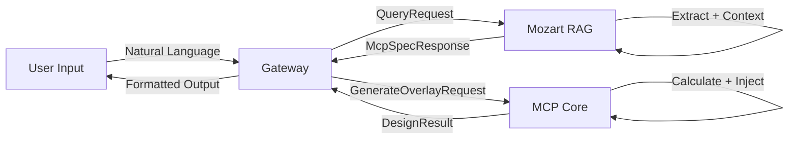

# 🎹 ACA Mozart

> **AI-Powered Electrical Design System** — พิมพ์ภาษาคน ได้แบบไฟฟ้าทั้งหลัง

[](LICENSE)
[](https://python.org)
[](https://fastapi.tiangolo.com)
[](https://react.dev)
[](https://cloud.google.com/run)

**ACA Mozart** เปลี่ยนภาษาธรรมดาให้กลายเป็นแบบไฟฟ้ามาตรฐาน วสท. / NEC — ภายในไม่กี่วินาที  
พิมพ์ `"ออกแบบบ้าน 2 ชั้น 3 ห้องนอน"` → ได้ Load Schedule, ขนาดสายไฟ, เบรกเกอร์, BOQ, Single-Line Diagram และ AutoLISP สำหรับ AutoCAD

---

## ✨ Features

| Feature | Description |
|---------|-------------|
| 💬 **Natural Language Input** | พิมพ์ภาษาไทย อธิบายบ้านและโหลดไฟฟ้า — ระบบเข้าใจและออกแบบให้ |
| ⚡ **MCP Core v2** | เครื่องคำนวณวิศวกรรม: Load Calculation, Breaker Sizing, Wire Sizing, Voltage Drop, Circuit Grouping |
| 📊 **Load Schedule + BOQ** | ตารางโหลดและรายการวัสดุ มาตรฐาน วสท. พร้อม export |
| 🏠 **Floor Plan** | วาง Layout อุปกรณ์ไฟฟ้าบนแบบบ้าน |
| 📄 **PDF Export** | ส่งออกรายงาน พร้อม QC Certificate |
| 🤖 **AutoLISP Generator** | สร้างสคริปต์ AutoCAD อัตโนมัติ — เปิดใน AutoCAD แล้ววางอุปกรณ์/เดินสายได้ทันที |
| 🛡️ **Safety Injectors** | Derating (อุณหภูมิ), kA Rating (ระยะหม้อแปลง), N-G Link (ตู้ Sub/Main) ตามมาตรฐาน |
| 🔍 **RAG Knowledge Engine** | Gemini + FAISS — ถามความรู้ไฟฟ้า/มาตรฐานได้ทันที พร้อมอ้างอิงแหล่งที่มา |

---

## 💬 Usage Example

```text
ช่วยออกแบบระบบไฟฟ้าสำหรับบ้านพักอาศัย 2 ชั้น ตามมาตรฐานไทย วสท.

รายละเอียดอาคาร:
- ระบบไฟฟ้า: 1 เฟส 230V
- ระบบสายดิน: TT
- สถานที่: กรุงเทพฯ

พื้นที่และห้อง:
1. ห้องนั่งเล่น ชั้น 1 ขนาด 30 ตร.ม.
2. ห้องครัว ชั้น 1 ขนาด 15 ตร.ม.
3. ห้องน้ำ ชั้น 1 ขนาด 4 ตร.ม.
4. ห้องนอนใหญ่ ชั้น 2 ขนาด 18 ตร.ม.
5. ห้องนอนเล็ก ชั้น 2 ขนาด 12 ตร.ม.
6. ห้องน้ำ ชั้น 2 ขนาด 5 ตร.ม.

โหลดไฟฟ้า:
- ห้องนั่งเล่น: แอร์ 18,000 BTU ×1, เต้ารับ 16A ×6
- ห้องครัว: เตา Induction 3,000W ×1, ไมโครเวฟ 1,500W ×1,
           หม้อหุงข้าว 800W ×1, ตู้เย็น 300W ×1, เต้ารับ 16A ×8
- ห้องน้ำ 1F: เครื่องทำน้ำอุ่น 3,500W ×1
- ห้องนอนใหญ่: แอร์ 12,000 BTU ×1, เต้ารับ 16A ×4
- ห้องนอนเล็ก: แอร์ 9,000 BTU ×1, เต้ารับ 16A ×3
- ห้องน้ำ 2F: เครื่องทำน้ำอุ่น 3,500W ×1

เงื่อนไข: แยกวงจรครัวหนัก, RCD ทุกเต้ารับ, แยกวงจรแอร์, มาตรฐาน วสท.
```

**ผลลัพธ์ที่ได้:**
- ✅ Load Schedule พร้อมขนาดสายไฟและเบรกเกอร์ทุกวงจร
- ✅ ครัวแยกวงจรหนัก (Induction + Microwave คนละวงจร)
- ✅ RCD/RCBO สำหรับห้องน้ำและเต้ารับทั้งหมด
- ✅ Single-Line Diagram
- ✅ BOQ รายการวัสดุ
- ✅ AutoCAD AutoLISP Script

---

## 🏗️ Architecture

```
┌──────────────────────────────────────────────────┐
│                  👤 User Input                     │
│           "ออกแบบบ้าน 2 ชั้น 3 ห้องนอน"             │
└─────────────────────┬────────────────────────────┘
                      │
                      ▼
┌──────────────────────────────────────────────────┐
│              🚪 Gateway (FastAPI)                  │
│         Routing · Auth · Rate Limiting             │
└────────┬─────────────────────────────┬────────────┘
         │                             │
         ▼                             ▼
┌─────────────────────┐    ┌──────────────────────────┐
│   🧠 Mozart RAG      │    │    ⚡ MCP Core v2         │
│  (Gemini + FAISS)    │    │   (Electrical Engine)     │
│                      │    │                          │
│ · Intent Detection   │    │ · Load Calculator        │
│ · Load Extraction    │    │ · Circuit Grouper        │
│ · Spec Generation    │    │ · Breaker / Wire Sizer   │
│ · Knowledge QA       │    │ · Safety Injectors       │
│ · Grounding Judge    │    │ · AutoLISP Generator     │
└──────────────────────┘    └──────────────────────────┘
         │                             │
         └──────────┬──────────────────┘
                    ▼
┌──────────────────────────────────────────────────┐
│                   📦 Output                        │
│   Load Schedule · BOQ · SLD · PDF · AutoCAD LISP   │
└──────────────────────────────────────────────────┘
```

### Data Flow



---

## 🛠️ Tech Stack

| Layer | Technology |
|-------|-----------|
| **Frontend** | React 18 · TypeScript · Tailwind CSS · Vite |
| **Backend** | Python 3.10+ · FastAPI · Uvicorn |
| **AI / NLP** | Google Gemini 2.5 Flash · FAISS Vector DB |
| **Engineering** | MCP Core v2 · Pandapower · EIT/WST Standards |
| **Infrastructure** | Google Cloud Run · Artifact Registry · Docker |
| **CI/CD** | GitHub Actions · Immutable Tag Deployment |
| **Database** | Supabase (PostgreSQL) · ChromaDB |
| **CAD** | AutoCAD AutoLISP |

---

## 📁 Project Structure

```
ACA_Mozart/
├── Copilot-Mozart/                  # RAG + Frontend
│   └── ACA_Mozart-copilot[RAG]/
│       ├── app/
│       │   ├── service.py           # Main RAG Service
│       │   ├── routes.py            # API Routes
│       │   ├── models.py            # Pydantic Data Models
│       │   ├── config.py            # App Configuration
│       │   ├── parsers/             # NLP Parsers (Regex + LLM)
│       │   ├── formatters/          # Output Formatters
│       │   └── display/             # Report Renderers
│       ├── core/
│       │   ├── database.py          # FAISS / ChromaDB
│       │   ├── ingest.py            # Knowledge Ingestion
│       │   └── privacy.py           # Grounding Judge
│       ├── rag_knowledge/           # Knowledge Base
│       │   ├── standard/            # วสท. / NEC Standards
│       │   ├── example/             # Design Examples
│       │   └── mcp/                 # MCP Spec Docs
│       ├── frontend_UI_UX/          # React Chat UI
│       └── tests/                   # Unit + Integration Tests
├── mcp_core_v2/                     # Electrical Calculation Engine
│   ├── core/
│   │   ├── load_calculator.py       # Load Calculation
│   │   ├── circuit_grouper.py       # Circuit Grouping
│   │   ├── breaker_selector.py      # Breaker Selection
│   │   ├── wire_sizer.py            # Wire Sizing
│   │   ├── autolisp_generator.py    # AutoCAD LISP Generator
│   │   └── compliance_checker.py    # Standards Compliance
│   ├── context/                     # Safety Injectors
│   │   ├── derating_injector.py     # Temperature Derating
│   │   ├── ka_rating_injector.py    # Short-Circuit kA
│   │   └── ng_link_injector.py      # N-G Link Rules
│   ├── cad/                         # AutoCAD Integration
│   └── tests/                       # E2E Test Suite
├── Doc/                             # Project Documentation
├── Docker/                          # Docker Configs
├── scripts/                         # Build + Deploy Scripts
└── README.md
```

---

## 🚀 Quick Start

### Prerequisites

- Python 3.10+
- Node.js 18+
- Docker (optional)
- Google Cloud account (for deployment)
- Google Gemini API key

### Local Development

```bash
# 1. Clone
git clone https://github.com/Pruek-Sang/ACA_Mozart.git
cd ACA_Mozart

# 2. Backend (MCP Core)
cd mcp_core_v2
python -m venv .venv && source .venv/bin/activate
pip install -r requirements.txt
python api.py

# 3. RAG Service (separate terminal)
cd Copilot-Mozart/ACA_Mozart-copilot[RAG]
python -m venv .venv && source .venv/bin/activate
pip install -r requirements.txt
cp .env.example .env   # ← Edit with your GOOGLE_API_KEY
python main.py

# 4. Frontend (separate terminal)
cd frontend_UI_UX/mozart-chat
npm install
npm run dev
```

### Docker

```bash
docker compose -f docker-compose.fullstack.yml up
```

---

## 📜 Standards Reference

| Standard | Scope |
|----------|-------|
| **วสท. 2001-56** | มาตรฐานการติดตั้งทางไฟฟ้าสำหรับประเทศไทย |
| **NEC 2023** | National Electrical Code (US) |
| **IEC 60364** | International Electrotechnical Commission — Low-voltage electrical installations |

---

## 🤝 Contributing

Pull requests welcome. For major changes, please open an issue first.

---

## 📄 License

MIT © 2024-2026 ACA Team
